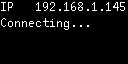
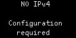
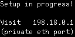
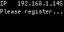
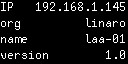

Setup of Linaro Automation Appliance
====================================

The Linaro Automation Appliance (LAA) should be connected to the fleet management cloud service to operate properly.

The fleet management cloud service is responsible to keep the LAA up-to-date with the latest software releases, connect the LAA to the right LAVA instance and configure the connected DUT.

In order to register on the fleet management cloud service, the LAA should be able to connect to internet.

Network configuration
---------------------

When connecting the LAA to your lab network, connect the ethernet cable to the LAA ``Main Eth`` ethernet port. This port is the public network port.

.. tip:: Public and Private network interfaces
    The LAA provides 2 network interfaces:

    * ``Main eth``: public ethernet port to connect the LAA to the lab network
    * ``DUT eth`` (facing upward): private ethernet port to connect the LAA to the DUT

With DHCP
~~~~~~~~~

By default, the LAA will request an IP address using DHCP. The IP address will be displayed on the OLED display.

Without DHCP
~~~~~~~~~~~~

In a lab network without a DHCP server, the OLED will display the message below and admins will have to update the LAA network configuration.

In order to configure the network, admins should browse to the LAA embedded web interface.

By default the embedded web interface is only available on the public network interface. To access it from the private network interface, press the `Soft Recovery` button and wait for the OLED to display:

Connect the admin laptop to the private LAA network interface. The LAA will automatically assign an IP address using dhcp to the laptop. Then browse to the LAA private ip address at [http://198.18.0.1](http://198.18.0.1)

.. tip:: Private network interface
    The private LAA network interface is the ethernet port facing upward and
    labeled ``DUT Eth``.

.. warning:: Network access
    When connected to the private network interface, a PC will be assigned the
    IP ``198.18.0.2`` but the PC will only be able to connect to the LAA at
    ``198.18.0.1``.
    From this network, it's not possible to have access to the local network
    nor the public internet.

In the web interface, browse to the network configuration page at http://198.18.0.1/appliance/network/settings/
and update the network configuration.

The configuration is using `systemd-network syntax <https://www.freedesktop.org/software/systemd/man/latest/systemd.network.html>`_.

To configure a static IP address, use:

::
  
  [Match]
  Path=platform-30bf0000.ethernet

  [Network]
  Address=10.10.10.2/24
  Gateway=10.10.10.1

The LAA should now have an IPv4 and the OLED display will look like:

.. warning:: Setup in Progress
    In order to display the above content, press again the ``Soft Recovery``
    button to disable access to the embedded web interface from the private
    network interface.

Cloud connectivity
------------------

Direct connection
~~~~~~~~~~~~~~~~~

The LAA should now automatically connect to the fleet management cloud service
and display:

.. tip:: Cloud connectivity
    The first connection to the cloud can take up to 20 seconds. If the LAA is
    not displaying the above message, then proceed to the next chapter about HTTP
    proxy.

If this is not the case, it's likely that the LAA should use an HTTP Proxy to
connect to the public internet.

HTTP Proxy
~~~~~~~~~~

If the LAA should use an HTTP proxy to access internet, this should be
configured in the LAA web interface.

Browse to the network configuration page and fill in the http proxy address.

.. tip:: Public network interface
    The LAA now has an IPv4, so you can directly browse to the LAA IPv4
    printed on the OLED.
    You should connect your PC to the same lab network as the LAA public
    network interface.

The OLED should now display:

If this is not the case, it's likely that the LAA should allow for SSL Interception.

SSL Interception
~~~~~~~~~~~~~~~~

TODO.

Registration
------------

Browse to the LAA embedded web server home page and click on the green
``register`` button. You will be redirected to the fleet management cloud
service.

After login, you can give a name to the appliance to complete registration. The
OLED will then display the organization and name of the LAA.

